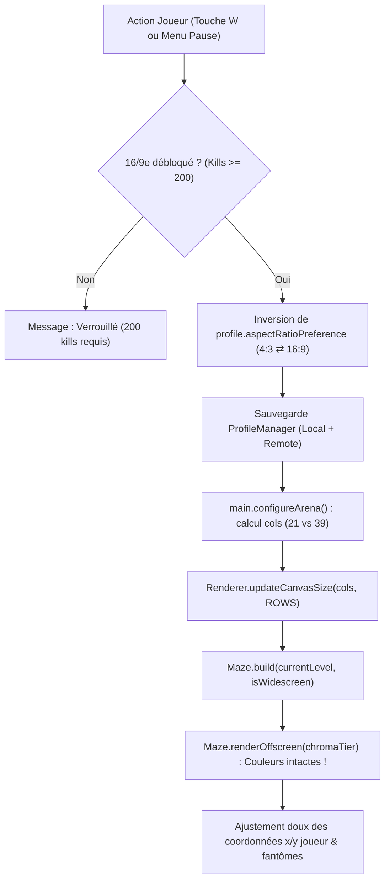

# 🔮 CHROMAVORE — Roadmap des Futures Améliorations

Ce document spécifie en détail la conception, l'architecture technique et les formules d'équilibrage des trois prochains chantiers majeurs pour **CHROMAVORE** & **CHROMAMANCER** :
1. **Gestion de 3 niveaux de difficulté avec indexation du gain d'XP par kill**.
2. **Pop-up interactive lors du déblocage du format 16/9e**.
3. **Sélecteur permanent 4/3 ⇄ 16/9e avec préservation intégrale des couleurs et de l'éveil chromatique**.

---

## 🎯 1. Système des 3 Niveaux de Difficulté & Calibration XP

### 1.1. Philosophie de Game Design
Actuellement, la difficulté augmente automatiquement avec les boucles (`loopCount`) et les kills en carrière. L'introduction de **trois niveaux de difficulté sélectionnables** permet de calibrer la session selon le profil de joueur (découverte, arcade classique ou maîtrise compétitive) tout en appliquant le principe fondamental du RPG : **plus le risque est élevé, plus la récompense en XP est importante**.

### 1.2. Spécification des 3 Niveaux

| Paramètre | Cadet (Facile) | Vétéran (Normal) | Cauchemar (Difficile) |
| :--- | :---: | :---: | :---: |
| **Identité** | Découverte & Prise en main | Expérience d'origine | Maîtrise, Vitesse & Risque |
| **Vitesse des Fantômes** | $\times 0.90$ ($-10\%$) | $\times 1.00$ (Standard) | $\times 1.15$ ($+15\%$) |
| **Durée de Peur (Super Pellets)** | $+20\%$ (7.2s $\to$ 8.6s) | $100\%$ (7.2s de base) | $-25\%$ (7.2s $\to$ 5.4s) |
| **Fréquence d'apparition Titans** | Délais de spawn $+30\%$ | Standard (tous les 50 kills) | Délais $-25\%$, agressivité max |
| **Dégâts / Pénalité de Mort** | Invulnérabilité au respawn accrue | Standard (2.0s invuln) | Invulnérabilité réduite (1.2s) |
| **Coefficient XP Kills** | **$\times 0.70$** ($-30\%$) | **$\times 1.00$** (Référence) | **$\times 1.60$** ($+60\%$) |
| **Bonus de Score Global** | $\times 0.80$ | $\times 1.00$ | $\times 1.35$ |

### 1.3. Formule Mathématique d'Indexation de l'XP
Dans [`src/systems/ExperienceSystem.ts`](src/systems/ExperienceSystem.ts) :
```typescript
public getGhostKillXp(comboMultiplier: number, difficulty: 'easy' | 'normal' | 'hard'): number {
  const baseGhostXp = 30;
  const difficultyCoeffs: Record<'easy' | 'normal' | 'hard', number> = {
    easy: 0.70,
    normal: 1.00,
    hard: 1.60
  };

  const diffMultiplier = difficultyCoeffs[difficulty] ?? 1.00;
  const aetherBonus = this.getAetherHarvestBonus() || 0;

  // Formule indexée : XP = Arrondi(Base * Combo * CoeffDifficulté * (1 + BonusAether))
  return Math.round(baseGhostXp * comboMultiplier * diffMultiplier * (1 + aetherBonus));
}
```

### 1.4. Intégration UI & Données
* **Profil Joueur** ([`PlayerProfile`](src/systems/ProfileManager.ts)) :
  * Ajout du champ : `selectedDifficulty: 'easy' | 'normal' | 'hard'` (défaut : `'normal'`).
* **Menu Principal & Écran Ready** :
  * Badge de difficulté dynamique sous le sélecteur de mode de jeu.
  * Touches de bascule rapide : `[ 1 ] Cadet`, `[ 2 ] Vétéran`, `[ 3 ] Cauchemar` (ou navigation au D-Pad / clic).
* **Leaderboard & Records** :
  * Les entrées conservent la mention du niveau de difficulté pour garantir l'équité des high-scores.

---

## ⚡ 2. Pop-up Interactive au Déblocage du 16/9e (Widescreen Awakening)

### 2.1. Contexte & Problématique Actuelle
Actuellement, lorsque le joueur franchit le seuil des 200 kills (`MADNESS_UNLOCK_KILLS`), le jeu bascule automatiquement en mode 16/9e panoramique (39 colonnes) lors du lancement ou du warp suivant. Certains joueurs souhaitent conserver la compacité et la lecture classique en 4/3 CRT (21 colonnes) sans être forcés à changer d'échelle.

### 2.2. Cinématique de Déblocage
Dès que le cap des 200 kills est franchi en cours de partie (ou à l'écran de fin de partie si débloqué à cet instant) :
1. **Gel temporaire / Freeze frame stylisé** (scanlines rétro, onde de choc dorée).
2. **Affichage d'une Modale Néon Synthwave** interactive avec double choix.

```
╔══════════════════════════════════════════════════════════════════╗
║                ✦ CHROMA AWAKENING : FORMAT 16:9 ✦                ║
║                                                                  ║
║  Vous avez franchi le seuil des 200 éliminations spectrales !    ║
║  Les frontières de la matrice s'étendent désormais à l'infini.   ║
║                                                                  ║
║  Souhaitez-vous basculer dès maintenant dans le format           ║
║  panoramique Widescreen (16:9), ou préférez-vous conserver      ║
║  le format arcade d'origine (4:3) ?                              ║
║                                                                  ║
║     [ ENTRÉE / A ]  ➜  DÉPLOYER LE FORMAT 16:9 (PANORAMIQUE)     ║
║     [ ÉCHAP / B ]   ➜  CONSERVER LE FORMAT 4:3 (ARCADE PUR)     ║
║                                                                  ║
║      (Ce choix pourra être modifié à tout moment en pause/menu)  ║
╚══════════════════════════════════════════════════════════════════╝
```

### 2.3. Logique d'Exécution
* Une variable persistante dans le profil joueur : `profile.hasPromptedWidescreenChoice: boolean`.
* Si `careerGhosts >= 200` et `!hasPromptedWidescreenChoice` :
  * Déclencher `showWidescreenUnlockModal()`.
  * Selon le choix : enregistrer `profile.aspectRatioPreference = '16:9' | '4:3'` et `profile.hasPromptedWidescreenChoice = true`.
  * Sauvegarder immédiatement le profil localement et sur Firebase RTDB.

---

## 🖥️ 3. Sélecteur Permanent 4/3 ⇄ 16/9e & Préservation des Couleurs

### 3.1. Règle Absolue : Dissociation Format / Éveil Chromatique
L'aspect ratio est une **propriété géométrique de la caméra et de la grille**, tandis que le **Chroma Awakening** (`ChromaTier` 0 Monochrome $\to$ 1 Cyan $\to$ 2 Magenta $\to$ 3 Full Neon Gold) est un **état d'éveil visuel et narratif**.

> **Principe clé :** Revenir en 4/3 ne doit **JAMAIS** désactiver les couleurs, néons, lueurs ou musiques HD débloqués ! Un joueur en 4/3 avec 500 kills bénéficie du niveau visuel et sonore maximal (Tier 3), tout en conservant la grille arcade étroite à 21 colonnes.

### 3.2. Points d'Accès du Sélecteur
1. **Écran Pause (`P` ou Échap)** :
   * Ajout d'une option sous le volume audio :
     `FORMAT D'ÉCRAN : [ ◄ 4:3 RETRO ► ]` ou `[ ◄ 16:9 WIDE ► ]`.
2. **Menu Principal** :
   * Raccourci clavier dédié : touche **`W`** (*Widescreen Toggle*).
   * Clic direct sur l'étiquette d'aspect ratio dans le HUD supérieur.

### 3.3. Architecture Technique de la Bascule à Chaud



### 3.4. Détails d'Implémentation dans le Code
1. **[`src/systems/ProfileManager.ts`](src/systems/ProfileManager.ts)** :
   ```typescript
   export interface PlayerProfile {
     // ...
     aspectRatioPreference: '4:3' | '16:9';
     hasPromptedWidescreenChoice: boolean;
     selectedDifficulty: 'easy' | 'normal' | 'hard';
   }
   ```
2. **[`src/main.ts`](src/main.ts)** :
   ```typescript
   public isWidescreenActive(): boolean {
     return this.isWidescreenUnlocked() && profileManager.profile.aspectRatioPreference === '16:9';
   }
   ```
3. Remplacement des anciens appels `this.isWidescreenUnlocked()` par `this.isWidescreenActive()` pour le rendu du labyrinthe et la taille du canvas, tout en garantissant que `this.renderer.chromaTier = getChromaTier(progression.totalGhosts)` reste déterminé uniquement par le nombre de kills.

---

## 📋 Résumé du Plan d'Action pour l'Implémentation

1. **Phase 1 — Profil & Modèle de Données** :
   * Mettre à jour `PlayerProfile` et `ProfileManager` avec les nouveaux champs (`selectedDifficulty`, `aspectRatioPreference`, `hasPromptedWidescreenChoice`).
   * Assurer la rétrocompatibilité des profils sauvegardés existants.
2. **Phase 2 — Système de Difficulté & Calibration XP** :
   * Étendre `ExperienceSystem` avec les multiplicateurs de difficulté sur les kills.
   * Ajouter les réglages de vitesse et timers dans `Enemy.ts` et `main.ts`.
   * Intégrer le sélecteur de difficulté dans le menu principal.
3. **Phase 3 — Modale de Choix 16/9e** :
   * Créer le composant de dialogue néon dans `index.html` ou directement tracé sur canvas dans `Renderer.ts`.
   * Brancher le hook de détection au cap des 200 kills.
4. **Phase 4 — Toggle Aspect Ratio à Chaud & Sauvegarde** :
   * Créer la méthode `toggleAspectRatio()` dans `Game` (`main.ts`).
   * Vérifier que la colorimétrie et les shaders du `ChromaTier` restent actifs quel que soit le format choisi.
   * Valider avec les tests automatisés headless et de contrats.
